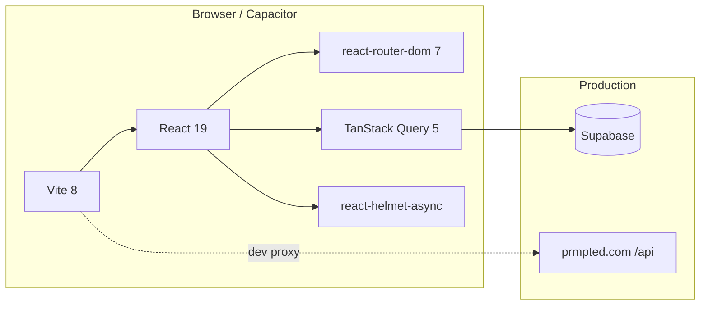

# Prompted Frontend

> **Hey Mouse** 👋
>
> I put together this working copy of the Prompted frontend and ran it through a serious pass: performance, landing page, code splitting, feed caching, skeleton loaders, OG image, and a lot of polish. It points at the **real production Supabase backend**, but that does not mean every feature works locally out of the box. Guest browsing and read-only surfaces do; logged-in profile, OAuth, and DMs are unreliable on localhost unless you configure Supabase redirect URLs (see **Auth and local dev**).
>
> This README is written for you. Read it top to bottom once, then keep [`CHANGELOG.md`](./CHANGELOG.md) and [`docs/MIGRATION.md`](./docs/MIGRATION.md) nearby when you need the full diff against the old tree.

<p align="center">
  <a href="https://prmpted.com"><strong>prmpted.com</strong></a>
  ·
  <a href="https://github.com/bitmousekatze/PromptedDesign"><strong>Repository</strong></a>
  ·
  <a href="./CHANGELOG.md">Changelog</a>
  ·
  <a href="./docs/MIGRATION.md">Old vs New</a>
  ·
  <a href="./docs/DEVELOPMENT.md">Dev Guide</a>
</p>

---

## Quick start

Use **pnpm** or **npm** (both work). The repo commits `package-lock.json` for npm users.

```bash
pnpm install   # recommended — works out of the box
pnpm dev
```

```bash
npm install    # also fine — `.npmrc` enables legacy peer deps for React 19
npm run dev
```

Open the URL Vite prints (usually `http://localhost:5173`).

| Command | What it does |
|---------|--------------|
| `npm run dev` | Local dev server with HMR |
| `npm run build` | Production build (see warning below) |
| `npm run preview` | Serve the production build locally |
| `npm test` | Run Vitest (22 tests) |

> [!NOTE]
> `react-helmet-async@2.0.5` lists React 18 in its peer range, but we run React 19. **pnpm** installs cleanly; **npm** needs the repo `.npmrc` (`legacy-peer-deps=true`) or `npm install --legacy-peer-deps`. Without that, npm throws `ERESOLVE`.

> [!IMPORTANT]
> On `localhost`, the landing page auto-dismisses so you land on the **guest dashboard** immediately (anonymous feed). That is different from being logged in. I could browse as guest at surface level just fine, but I could **not** log in on localhost and test my live profile during this pass (see **Auth and local dev** below). Guests on production still see the landing until they sign in or tap **Browse as guest**.

> [!WARNING]
> `npm run build` runs `vite build && node scripts/embed-shell.mjs`. The `scripts/` folder is **not on this branch yet**, so the embed step fails after Vite succeeds. For local bundle checks, run `npx vite build` directly. Restore `scripts/` from `main`/`master` (or your deploy repo) before shipping a Capacitor build.

> [!NOTE]
> This work lives on branch **`redesign-handoff`** in the canonical repo below. Review and merge when ready; nothing here auto-deploys until you wire that up on your side.

---

## What changed (the short version)

If you only have five minutes, here is what I changed from the **original baseline** on your repo (pre-redesign `main`/`master` before this branch):

| Area | Old copy | This copy |
|------|----------|-----------|
| **React / Vite** | React 18 + Vite 5 | React 19 + Vite 8 (Rolldown) |
| **Routing shell** | `main.jsx` mounts `<App />` directly | `BrowserRouter` + catch-all route in `router.jsx` |
| **Code splitting** | Landing page lazy only | 30+ lazy chunks (pages, modals, sidebars) |
| **Feed data** | Manual `useState` + `loadPosts()` | TanStack Query via `lib/feedPosts.js` |
| **Feed size** | Personalized cap **500** posts | Cap **150** (faster first paint) |
| **Builds tab** | Always fetched with posts | Deferred until Builds tab is active |
| **PostCard** | Plain export | `React.memo` with custom comparator |
| **Skeletons** | Spinners / empty flashes | `SkeletonLoader`, `PageLoader`, sidebar skeletons |
| **Landing** | Basic lazy gate | Full marketing page: video hero, AI burst, communities carousel, leaderboard |
| **Landing CTAs** | Mixed behavior | Hero **Start exploring** / **See trending** open auth modal; bottom **Browse as guest** hits dashboard |
| **Auth modal** | Inline in `App.jsx` (~300 lines) | Extracted `AuthModal.jsx`; scroll only on signup |
| **`App.jsx` size** | ~14,956 lines | ~12,988 lines |
| **`appStyles.css`** | ~19,042 lines | ~18,230 lines + 6 CSS modules |
| **OG image** | 512×512 PNG | 1200×630 JPG (`OG_IMAGE_URL` constant) |
| **Dead code** | Sandbox, admin libs, unused loaders | Removed (see changelog) |
| **Package manager** | npm + `package-lock.json` | npm or pnpm (`.npmrc` fixes npm + React 19 peer mismatch) |

Full side-by-side tables, file lists, and architecture notes live in [`docs/MIGRATION.md`](./docs/MIGRATION.md).

---

## Tech stack



If the diagram above does not render in your GitHub view, use the table below.

| Layer | Package |
|-------|---------|
| UI | React 19, framer-motion 12 |
| Bundler | Vite 8 + `@vitejs/plugin-react` 6 |
| Router | `react-router-dom` 7 (Phase 1 shell; internal routing still tab-based) |
| Data | `@supabase/supabase-js`, TanStack Query |
| SEO | `react-helmet-async`, dynamic OG tags in `App.jsx` |
| Analytics | `@vercel/analytics` (wired), `@vercel/speed-insights` (installed, not mounted yet) |
| Mobile deps | Capacitor 8 (no `android/` project in this copy) |
| Tests | Vitest 4 + Testing Library + jsdom |

---

## Project layout

```
.
├── index.html                 # Static meta, OG tags, initial loader
├── landing-preview.html       # Optional offline landing mockup (~1.7 MB, no server)
├── public/
│   ├── og-image.jpg           # 1200×630 social share image
│   ├── video.webm             # Landing hero background
│   └── hero.webp              # Landing still fallback
├── src/
│   ├── main.jsx               # QueryClient + HelmetProvider + AppRouter
│   ├── router.jsx             # BrowserRouter catch-all (Phase 1.4)
│   ├── App.jsx                # Still the monolith (~13k lines) but slimmer
│   ├── appStyles.css          # Global styles (~18k lines)
│   ├── pages/                 # 14 lazy-loaded tab pages
│   ├── components/
│   │   ├── LandingPage.jsx    # New marketing landing (~3.2k lines)
│   │   ├── AuthModal.jsx      # Extracted from App.jsx
│   │   ├── SkeletonLoader.jsx # Feed + sidebar skeletons
│   │   ├── post/              # PostCard (memoized), FullPostView, modals
│   │   └── community/         # Communities UI
│   ├── lib/
│   │   ├── feedPosts.js       # TanStack Query feed + builds fetchers
│   │   ├── queryClient.js     # Shared QueryClient defaults
│   │   └── appShared.js       # SITE_ORIGIN, OG_IMAGE_URL, auth helpers
│   └── test/                  # sanitize, links, app smoke tests
└── docs/
    ├── MIGRATION.md           # Old vs new comparison for you
    └── DEVELOPMENT.md         # Day-to-day dev notes
```

---

## Routing (read this before you refactor)

Prompted uses a **hybrid** model today:

1. **`router.jsx`** wraps everything in `BrowserRouter` with a single `/*` route to `<App />`.
2. **`App.jsx`** still owns navigation via `activeTab` + `window.history.pushState` / `replaceState`.
3. Deep links (`/post/...`, `/:username`, `/community/...`, `/games/*`, etc.) are parsed on mount and in `popstate`.

Phase 2 (not done yet) splits real routes per page so Suspense boundaries are per-tab instead of app-wide. `handleNavClick` already wraps tab changes in `React.startTransition()` so lazy chunks load without a full-page flash.

---

## Landing page

`src/components/LandingPage.jsx` is the canonical in-app landing. Highlights:

- **Video hero** (`/video.webm`) with slow playback and reduced-motion fallback
- **AiBurst** logo carousel above the hero title
- **Field picker** (marketer, student, developer, etc.) with demo content
- **Communities carousel** with glass pillar cards and mouse-tracked glow borders
- **Builder rank flip cards** with cursor spotlight (`--mx` / `--my` CSS vars)
- **Live leaderboard** from `get_builder_leaderboard` RPC (falls back to mocks; demo name `mousedevv` at rank 5)
- **CTAs**: Hero **Start exploring** and **See trending** → auth modal (`onSignup`); bottom **Browse as guest** → dashboard without login

`landing-preview.html` is an optional offline mockup (~1.7 MB). The real in-app landing is `src/components/LandingPage.jsx`. Use the HTML file only if you want a quick static preview without running Vite.

---

## Performance work (why the feed feels snappier)

<details>
<summary><strong>TanStack Query feed</strong></summary>

- `fetchFeedPosts` / `fetchBuildPosts` live in `src/lib/feedPosts.js`
- Feed query key: `['feed', 'posts', userId ?? 'anon']`
- Builds query only runs when `buildsFeedEnabled` is true (Builds tab active)
- Defaults: `staleTime: 60s`, `refetchOnWindowFocus: false`, `retry: 1`

</details>

<details>
<summary><strong>Deferred non-critical fetches</strong></summary>

`loadAllUsers` and `loadSchoolLeaderboard` are scheduled with `requestIdleCallback` so they do not compete with the first feed paint.

</details>

<details>
<summary><strong>Lazy loading + code splitting</strong></summary>

30+ `React.lazy()` imports: all tab pages, modals, sidebars, landing, workflows, and more. Signed-in users never download the landing chunk unless they log out.

</details>

<details>
<summary><strong>PostCard memoization</strong></summary>

`PostCard.jsx` exports `React.memo(PostCard, postCardPropsAreEqual)` to cut unnecessary feed re-renders on like/save updates.

</details>

<details>
<summary><strong>Images</strong></summary>

Feed images use `loading="lazy"`. Videos use `preload="metadata"` in PostCard, FullPostView, and VideosPage.

</details>

---

## Auth and local dev

### My localhost experience (fact-checked against the code)

I could **browse as guest on localhost at surface level** just fine: the landing auto-dismisses, the anonymous feed loads, and you can click around the shell without signing in.

I could **not log in on localhost and test my live profile** during this handoff. The most likely reason is Supabase Auth redirect configuration:

- Web OAuth in `AuthModal.jsx` passes `redirectTo: window.location.origin` (for example `http://localhost:5173`).
- That URL must be in the Supabase project **Redirect URLs** allowlist. This repo has no dashboard config, but production is clearly set up for `prmpted.com`, and I never got a successful OAuth round-trip back to localhost.
- `App.jsx` even notes that OAuth on local dev is painful because redirects tend to leave you on prod instead of localhost.
- **Email/password login** uses `signInWithPassword` (direct API, no browser redirect). It may work if you have valid credentials, but I did not successfully use it to test my logged-in profile locally during this pass.

To test a real logged-in session (your profile, DMs, saves, etc.), use **production** or add localhost URLs to Supabase Auth redirect allowlist (for example `http://localhost:5173` and `http://127.0.0.1:5173`).

| Scenario | Behavior |
|----------|----------|
| Guest at `/` on production | Landing page |
| Guest at `/` on localhost | Landing skipped; **guest dashboard** (not logged in) |
| Guest deep link (`/post/abc`) | Landing skipped; content loads |
| `?landing=1` | Force landing preview (works on localhost too) |
| OAuth (Google/GitHub) on localhost | Unreliable here; redirect allowlist appears production-only |
| Email/password on localhost | No redirect needed; may work, but I did not verify logged-in profile locally |
| Guest browse on localhost | Works at surface level (anonymous feed, navigation shell) |

Auth UI lives in `src/components/AuthModal.jsx`. Scroll is disabled on login/landing views; signup scrolls with a styled scrollbar.

Multi-account switching still uses `lib/accountStore.js`. Native OAuth uses Capacitor deep link `com.prmpted.app://auth-callback` via `lib/nativeBootstrap.js`.

---

## Your admin hooks (yes, I kept them)

You are wired in as admin across the app:

| Location | Detail |
|----------|--------|
| `lib/appShared.js` | `ADMIN_USERNAMES` includes `mouse`, `devmouse` |
| `LearningPage.jsx` | `LEARN_ADMIN_USERNAMES` |
| `SpotlightPage.jsx` | `SPOTLIGHT_PREVIEW_USERNAME = 'devmouse'` |
| `ZoePage.jsx` | Boost purchase gated to `@mouse` while flow is finalized |
| `App.jsx` | **Grumm easter egg**: any `devmouse` text flips upside-down (Minecraft reference) |
| `LandingPage.jsx` | Leaderboard fallback shows `mousedevv` at rank 5 |

---

## What was removed

These were confirmed unused in the old tree and are gone now:

| Removed | Why |
|---------|-----|
| `src/components/sandbox/*` | WIP BYOK sandbox, no imports |
| `src/lib/adminStats.js` | No callers |
| `src/lib/aiAdvisors.js` | No callers |
| `src/lib/reports.js` | No callers |
| `src/components/CircularGallery.jsx` | Orphan component |
| `public/gamepad-icon.png` | Broken asset (HTML mislabeled as PNG) |
| Dead state in `App.jsx` | `stats`, `creators`, `creatorSearch` loaders never rendered |

---

## What still does not work locally (or is unreliable)

- **OAuth login returning to localhost** (redirect allowlist appears production-only; I could not test my live profile this way)
- **Stripe checkout** (hits live `/api` via Vite proxy)
- **Push notifications**
- **Cafeteria GIF picker**

Guest browsing and read-only surfaces generally work. Logged-in flows are best verified on production unless you add localhost to Supabase redirect URLs.

---

## Tests

```bash
npm test
```

| File | Covers |
|------|--------|
| `src/test/sanitize.test.js` | HTML sanitization regressions |
| `src/test/links.test.jsx` | URL safety, MentionText linkify, XSS schemes |
| `src/test/app.test.jsx` | Supabase smoke + App render (may hit network) |

Last run: **22/22 passing**.

---

## Social / SEO

- Static tags in `index.html` point at `https://prmpted.com/og-image.jpg` (1200×630)
- `OG_IMAGE_URL` in `src/lib/appShared.js` is the single runtime constant
- Post deep links update `og:title`, `og:description`, and `og:image` in `App.jsx`
- `FullPostView.jsx` sets per-post Helmet + JSON-LD

---

## Roadmap (from the migration plan)

> [!NOTE]
> These are documented intentions, not blockers for you to ship.

| Phase | Status | Next step |
|-------|--------|-----------|
| 1.x Router + lazy pages | Done | Per-route Suspense (Phase 2) |
| 2.x React 19 + CSS modules | In progress | 6 components modularized; more TBD |
| 3.x Vite 8 | Done | Build time ~4x faster vs Vite 5 |
| 4.x Full router migration | TODO | Replace `activeTab` state machine with real routes |
| Speed Insights | TODO | Mount `<SpeedInsights />` next to `<Analytics />` |

See [`CHANGELOG.md`](./CHANGELOG.md) for commit-level detail.

---

## Repository

| | URL |
|---|-----|
| **Canonical repo** | [github.com/bitmousekatze/PromptedDesign](https://github.com/bitmousekatze/PromptedDesign) |
| **Handoff branch** | `redesign-handoff` |

```bash
git clone https://github.com/bitmousekatze/PromptedDesign.git
cd PromptedDesign
git checkout redesign-handoff
pnpm install && pnpm dev
# or: npm install && npm run dev  (uses .npmrc for React 19 peers)
```

This branch bundles the redesign pass: landing page, TanStack Query feed, code splitting, skeleton loaders, OG image, and doc cleanup.

---

## Questions?

If something feels off, check in this order:

1. [`docs/DEVELOPMENT.md`](./docs/DEVELOPMENT.md) for gotchas
2. [`docs/MIGRATION.md`](./docs/MIGRATION.md) for "did the old copy have this?"
3. [`CHANGELOG.md`](./CHANGELOG.md) for when it changed
4. Inline comments in `router.jsx`, `App.jsx`, and `vite.config.js` (often more current than any doc)

I hope you like what landed here. The app is the same product underneath, just faster, cleaner, and with a landing page that actually sells Prompted.