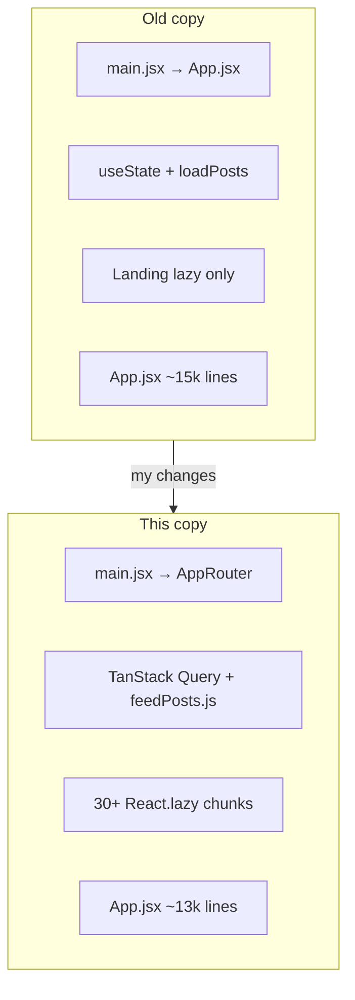

# Old vs New: Migration Guide for Mouse

This document compares the **baseline** you started from against **this repo**.

| | Reference |
|---|-----------|
| **Old (baseline)** | `main`/`master` on [bitmousekatze/PromptedDesign](https://github.com/bitmousekatze/PromptedDesign) before this pass |
| **New (this branch)** | `redesign-handoff` on [bitmousekatze/PromptedDesign](https://github.com/bitmousekatze/PromptedDesign) |
| **Clone** | `git clone https://github.com/bitmousekatze/PromptedDesign.git` |

---

## Executive summary

This is **not** a greenfield rewrite. The product surface is the same: feed, builds, arena, games, learn, spotlight, communities, DMs, achievements, and everything else you already had. What changed is **how the frontend loads and renders**:

- Smaller initial bundle (30+ lazy chunks vs 1)
- Cached feed via TanStack Query instead of manual refetch loops
- A real marketing landing page with video, motion, and live data
- Slimmer monolith (`App.jsx` dropped ~2,000 lines; more extracted to components)
- Modern toolchain (React 19, Vite 8, react-router-dom 7 shell)



---

## Toolchain diff

| | Old | New | Impact |
|---|-----|-----|--------|
| Package manager | npm (`package-lock.json`) | npm (`package-lock.json`) | Removed stray `pnpm-lock.yaml`; same manager |
| React | 18.2.0 | **19.2.7** | Better concurrent rendering |
| Vite | 5.0.0 | **8.1.3** (Rolldown) | Build ~4x faster |
| react-router-dom | absent | **7.18.1** | Phase 1 router shell |
| Vitest | 4.0.18 | 4.1.10 | Same test suite, 22 tests |
| @vitejs/plugin-react | 4.2.0 | 6.0.3 | Vite 8 compat |
| postcss-hover-media-feature | absent | present | Hover styles only on hover-capable devices |
| @vercel/speed-insights | absent | in deps, not mounted | Ready for you to wire |
| boneyard-js | absent | in deps, unused in src | Future use? |

Scripts in `package.json` are **unchanged** (still reference `scripts/embed-shell.mjs`, which is missing in both copies).

---

## File size diff

| File | Old lines | New lines | Delta |
|------|-----------|-----------|-------|
| `src/App.jsx` | 14,956 | 12,988 | **-1,968** |
| `src/appStyles.css` | 19,042 | 18,230 | **-812** |
| `src/router.jsx` | n/a | ~55 | new |
| `src/lib/feedPosts.js` | n/a | ~78 | new |
| `src/components/LandingPage.jsx` | existed | ~3,200+ | heavily redesigned |

---

## Architecture: routing

### Old

```
main.jsx
  └── <App />                    # direct mount, no router
        ├── activeTab state
        ├── history.pushState / replaceState
        └── popstate listener    # ~line 5842, parses all deep links
```

- 15 pages **eagerly imported**
- Only `LandingPage` was `React.lazy()`
- Games and Learning each had internal `parseRoute()` + `popstate`

### New

```
main.jsx
  └── <QueryClientProvider>
        └── <HelmetProvider>
              └── <AppRouter />           # router.jsx
                    └── <BrowserRouter>
                          └── <Route /*> 
                                └── <Suspense>
                                      └── <App />    # same tab machine inside
```

- **14 pages** lazy-loaded in `App.jsx`
- **16+ modals/sidebars** also lazy-loaded
- `handleNavClick` uses `React.startTransition()` for tab switches
- Phase 2 TODO: replace catch-all with per-route `<Route path="/arena" ...>`

> [!TIP]
> If you are planning a router refactor, start by moving one tab (e.g. `/arena`) to its own route file while keeping `activeTab` as a compatibility shim. The comments in `router.jsx` spell out the intended end state.

---

## Architecture: data fetching

### Old feed pipeline

```javascript
// Conceptual flow in old App.jsx
const [posts, setPosts] = useState([]);
const loadPosts = async () => {
  setLoading(true);
  const { data } = await supabase.rpc('get_personalized_feed', {
    p_user_id: userId,
    p_limit: 500,   // large cap
    p_offset: 0,
  });
  setPosts(data);
  setLoading(false);
};
useEffect(() => { loadPosts(); }, [userId, feedSort]);
```

- Builds loaded alongside posts every time
- No shared cache between tab switches
- `PostCard` re-rendered on any parent state change

### New feed pipeline

```javascript
// src/lib/feedPosts.js + App.jsx
const feedQuery = useQuery({
  queryKey: feedPostsQueryKey(user?.id),
  queryFn: () => fetchFeedPosts(user?.id),
});

const buildsFeedQuery = useQuery({
  queryKey: ['feed', 'builds', user?.id],
  queryFn: () => fetchBuildPosts(user?.id),
  enabled: buildsFeedEnabled,  // only when Builds tab active
});
```

| Behavior | Old | New |
|----------|-----|-----|
| Personalized limit | 500 | **150** |
| Fallback limit | 150 | 150 |
| Cache | none | 60s stale time |
| Refetch on focus | n/a | disabled |
| Builds fetch | always | **deferred** |
| PostCard | plain export | `React.memo` |

---

## Landing page diff

| Feature | Old | New |
|---------|-----|-----|
| Hero background | static / simpler | `video.webm` with slow playback |
| AI branding | basic or absent | AiBurst looping logo carousel |
| Communities | simpler section | Glass pillar carousel, glow borders |
| Leaderboard | static or mock | Live RPC + `mousedevv` fallback |
| Hero CTAs | mixed | **Start exploring** / **See trending** open auth modal (`onSignup`) |
| Guest path | dismiss only | **Browse as guest** → guest dashboard (anonymous feed) |
| Localhost login / live profile | not documented | **Not verified locally**; OAuth redirect allowlist likely prod-only |
| Typography | iterated | Urbanist + Instrument Serif (final) |
| Lazy load | yes | yes (unchanged benefit) |
| localhost bypass | yes | yes |
| Deep link bypass | yes | yes |

Optional `landing-preview.html` (~1.7 MB) remains as an offline mockup; the canonical landing is `LandingPage.jsx`.

---

## Auth diff

| | Old | New |
|---|-----|-----|
| Auth UI location | ~300 lines **inline** in `App.jsx` | `src/components/AuthModal.jsx` (lazy) |
| Password reset | inline in `App.jsx` | `PasswordResetModal.jsx` (lazy) |
| Modal scroll | uniform | login: no scroll; signup: scroll + styled bar |
| OAuth / multi-account | same libs | unchanged behavior; localhost OAuth still blocked without redirect allowlist |
| Localhost logged-in profile | not documented | not verified during handoff (guest browse OK) |
| Avatar carousel | simpler | diagonal carousel in `AuthHeroPanel` |

---

## UI / UX diff

| Area | Change |
|------|--------|
| Sidebar | AnimatedIcon nav; iPad width fixes |
| Logo | Click returns to landing / home |
| Skeletons | `PostCardSkeleton`, `RightSidebarSkeleton`, `PageLoader` |
| Images | `loading="lazy"` on feed cards |
| Videos | `preload="metadata"` |
| Nested anchors | Fixed invalid `<a>` inside `<a>` in posts/communities |
| Fonts | Preload + preconnect; Urbanist + Instrument Serif |
| devmouse | Grumm easter egg (upside-down text) preserved |

---

## Files only in OLD

| Path | What it was | Status in new |
|------|-------------|---------------|
| `src/components/sandbox/SandboxRunner.tsx` | BYOK prompt runner | **Removed** (unused) |
| `src/components/sandbox/ApiKeyManager.tsx` | API key storage | **Removed** |
| `src/components/sandbox/RunHistory.tsx` | Run history UI | **Removed** |
| `src/lib/adminStats.js` | Admin RPC helpers | **Removed** |
| `src/lib/aiAdvisors.js` | Advisor dashboard RPCs | **Removed** |
| `src/lib/reports.js` | Reporting utils | **Removed** |
| `public/gamepad-icon.png` | Static icon | **Removed** (broken file) |

> [!NOTE]
> If you still want the sandbox locally, recover it from pre-redesign git history on `main`/`master`. Nothing in the live app imported these files.

---

## Files only in NEW

| Path | Purpose |
|------|---------|
| `src/router.jsx` | BrowserRouter shell |
| `src/lib/feedPosts.js` | Query fetchers for feed + builds |
| `src/components/PageLoader.jsx` | Full-page loading state |
| `src/components/SkeletonLoader.jsx` | Feed/sidebar skeletons |
| `src/components/StoriesCarousel.jsx` | Stories UI |
| `src/components/BadgeTabs.jsx` | Tab badge component |
| `src/components/UserProfileSidebarCard.jsx` | Sidebar profile card |
| `*.module.css` (6 files) | Scoped styles for AdUnit, BuiltWithSelector, OnboardingWizard, DailyRewardModal, CommunitySelector, CommunityChannels |
| `postcss.config.mjs` | Hover media feature plugin |
| `public/og-image.jpg` | 1200×630 OG asset |
| `public/video.webm` | Landing hero video |
| `public/hero.webp` | Landing fallback image |
| `src/assets/models/*.svg` | Tool logos for landing |

---

## CSS modularization progress

| Component | Module file | Status |
|-----------|-------------|--------|
| AdUnit | `AdUnit.module.css` | Done |
| BuiltWithSelector | `BuiltWithSelector.module.css` | Done |
| OnboardingWizard | `OnboardingWizard.module.css` | Done |
| DailyRewardModal | `DailyRewardModal.module.css` | Done |
| CommunitySelector | `CommunitySelector.module.css` | Done |
| CommunityChannels | `CommunityChannels.module.css` | Done |
| Everything else | `appStyles.css` | Still global (~18k lines) |

Pattern: camelCase scoped classes, shared utilities stay global, old CSS left as dead code until batch cleanup.

---

## Code splitting inventory (new)

<details>
<summary><strong>Lazy pages (14)</strong></summary>

- ArenaPage, GamesPage, LearningPage, BuilderRanksPage
- ProPage, SpotlightPage, ReferralsPage, VideosPage, MemesPage
- ZoePage, AchievementsPage, WeeklyReportPage
- ReviewDraftPage, DraftsListPage

</details>

<details>
<summary><strong>Lazy modals and panels</strong></summary>

- AuthModal, PasswordResetModal, SettingsModal, AccountDeletionModal
- CreatePostModal, CreateCommunityModal, EditCommunityModal
- DailyRewardModal, FullPostView
- OnboardingWizard

</details>

<details>
<summary><strong>Lazy layout / feature chunks</strong></summary>

- LandingPage, RightSidebar, MessagesView, CommunitiesView
- UserProfileView, UserProfileSidebarCard, CreatePostBox
- WorkflowCard, CreateWorkflow, WorkflowDetail
- MaintenanceBanner, NotificationFx, ProfileChannels, LiveBanner

</details>

---

## SEO / meta diff

| | Old | New |
|---|-----|-----|
| OG image | `og-image.png` 512×512 | `og-image.jpg` 1200×630 |
| Twitter card | `summary` | `summary_large_image` |
| Runtime constant | hardcoded URLs | `OG_IMAGE_URL` in `appShared.js` |
| Per-post OG | DOM meta updates | same, now with JPG fallback |

---

## Test diff

| | Old | New |
|---|-----|-----|
| Test count | 20 | **22** |
| Test files | 3 | 3 (same names) |
| App mount | QueryClient + Helmet | + AppRouter |

---

## What did NOT change

These are intentionally the same so you do not have to relearn the app:

- Supabase client and auth flow (`src/lib/supabase.js`)
- `activeTab` navigation model inside `App.jsx`
- Deep link path parsing logic
- Feature flags: `canSeeLounge = () => false`, `canSeePro = () => true`
- Capacitor native bootstrap (`lib/nativeBootstrap.js`)
- Multi-account store (`lib/accountStore.js`)
- Admin usernames including `mouse` and `devmouse`
- Vite `/api` proxy to `https://prmpted.com`
- Product branding: **Prompted** / **prmpted.com**

---

## Recommended first steps for you

1. `npm install && npm run dev`
2. Log in, hit the feed, switch Posts/Builds, open Arena and Spotlight
3. Log out, confirm landing CTAs and guest browse
4. Run `npm test`
5. Read `router.jsx` and the top of `App.jsx` imports (lazy map)
6. Decide if you want to mount Speed Insights and restore `scripts/` from main repo

> [!IMPORTANT]
> The biggest remaining tech debt is the `App.jsx` monolith and the catch-all Suspense wrapper. The performance work makes it fast enough to ship; the router Phase 2 work makes it maintainable long term.